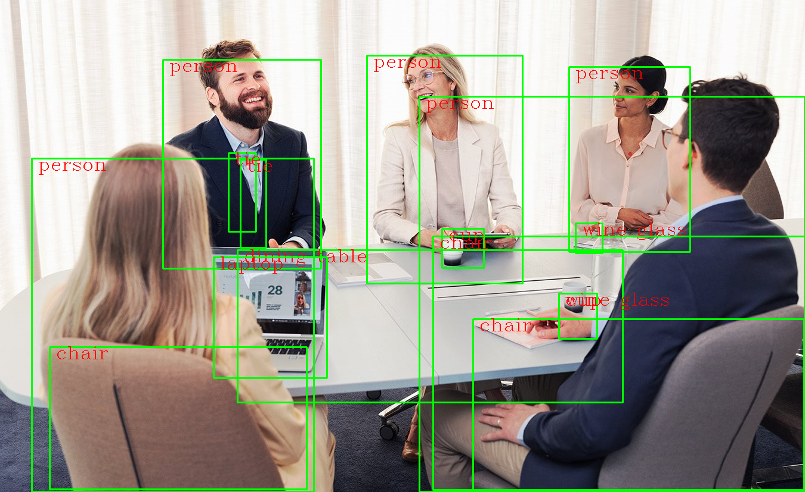
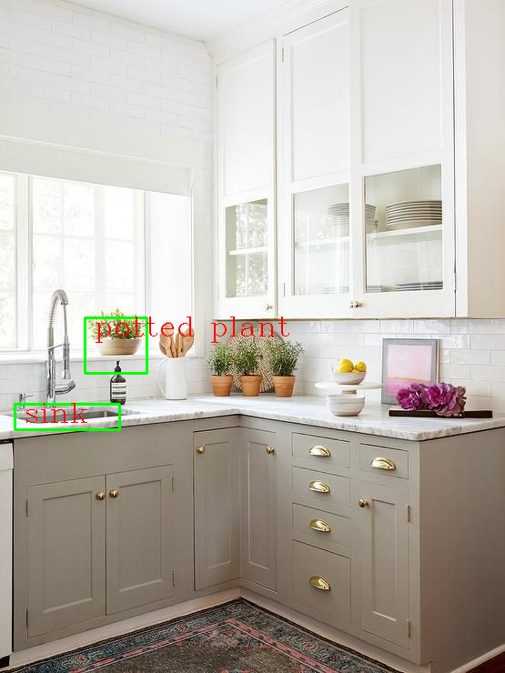

# object_detection

This code uses OpenCV to open the webcam and run the ssd_mobilenet_v3 model to detect objects in each frame. 
After detection, it calculates the distance between the camera and the detected objects using the known width of the object and the focal length. 
The resulting video, displaying the object names and distances, is saved in the output folder with a timestamp to ensure a unique name for each video. The code displays the video in real-time on the screen and continues recording until the "q" key is pressed to end the recording. After completion, the video is saved and automatically played using the default player on the device

